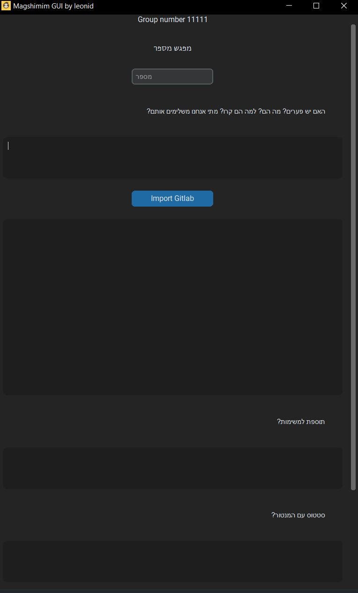
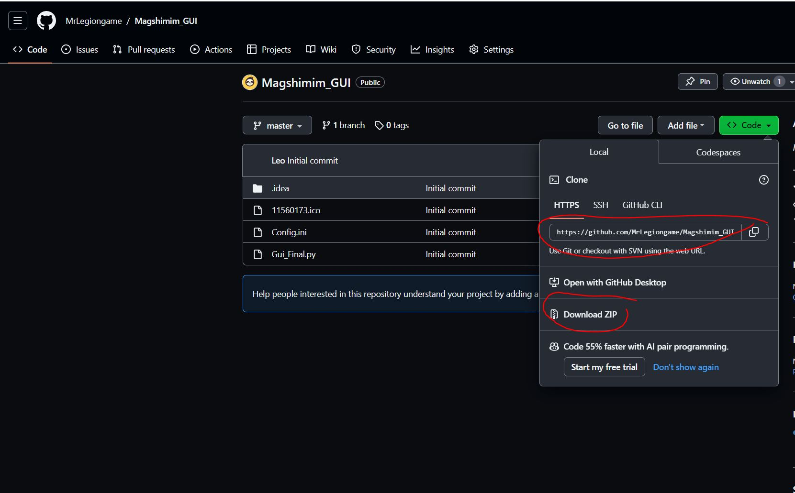
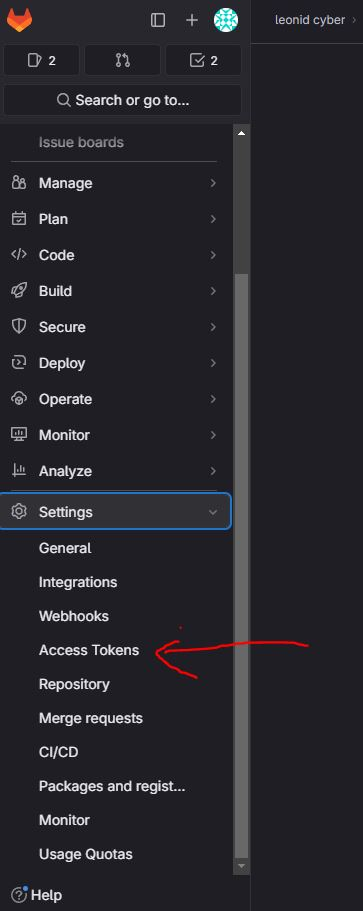
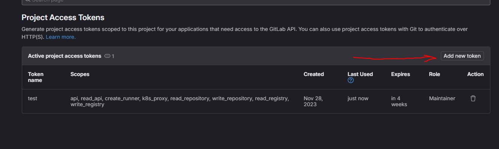
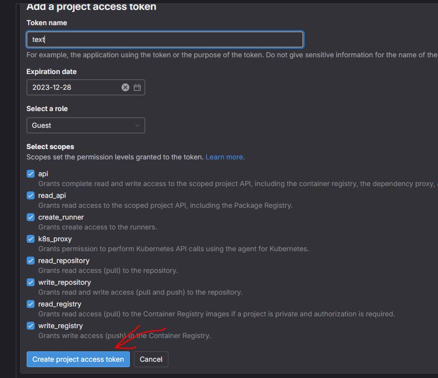
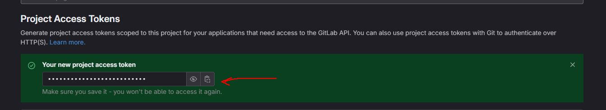
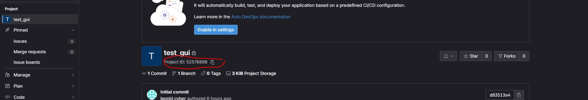

# Magshimim GUI

## Table of Contents
* [General Info](#general-information)
* [Setup](#setup)
* [Contact](#contact)
<!-- * [License](#license) -->

## General Information
This project helps to create summary emails for magshimim students

## How to run 
In IDE: 
open the IDE (like pycharm) and use the command in the command line: 
pip install -r requirements.txt
python main.py

From desktop: 
Open command line
Use the command "cd ./project location"
Use the command ".\venv\Scripts\activate"
Use the command "pip install -r requirements.txt"
Use the command "python run.py"

## Setup

Step 1: 
download the repository to your PC

Step 2: 
open Config.ini and fill in the settings: 
Team -> The team number that you got from the team lead

Key -> API key from the project in GitLab (Only the owner of the project can create one)

ID -> Your Project ID

Step 3: 
Run the code and enjoy :)
## Contact
Created by [@MrLegiongame](https://www.linkedin.com/in/leonid-vyushkov/) - feel free to contact me!
